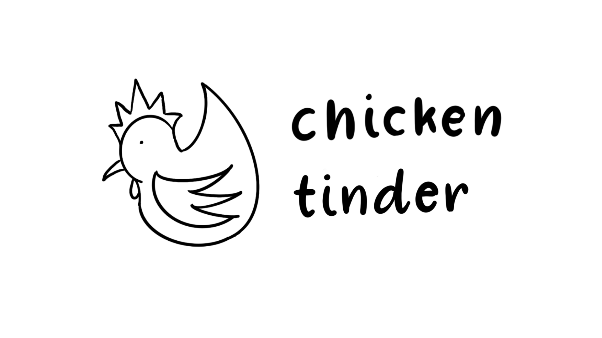

<h1> Chicken Tinder </h1>

Table of Contents

 
 <ol> 
    <li> <a href="#about"> About the Project </a></li>
    <li> <a href="#features"> Features </a></li>
    <li> <a href="#retrospective"> Retrospective </a></li>
   <li> <a href="#tech-used"> Technologies Used </a></li>
  <li> <a href="#contributors"> Contributors </a></li>
  </ol>

 <h2> About the Project </h2>
Choices, choices and more choices!  
  
  
With the varieties of restaurants and cuisines out there, eating out with someone else can be the biggest headache in the world leading to unnecessary arguments and wastage of time.
 
 
Chicken Tinder helps two people make a unanimous decision in deciding where to eat via a fun and playful way - removing conflicts and minimising the paradox of choices

<h2 id="features"> Features </h2>

<h3> User Authentication </h3>

<ul>
 <li>Multi-step signup process that asks for piecemeal information so as to keep user engaged</li>
 <li>Input validations prevents erroneous information from being stored in db</li>
</ul>

<h3> Add a friend </h3>

<ul>
 <li>Users can add friends via email addresses, this is to ensure that users can only add people whom they know</li>
 <li>Currently, adding a friend is one-sided, we would like to improve this by allowing users to send, accept and reject friend requests</li>
</ul>

<h3> Set location and proximity for restaurant options </h3>

<ul>
 <li>The first user initiates a session by setting location around which they wish to eat at. Proximity parameter allows users to decide how far they are willing to travel based on the center.</li>
 <li>User can then start swiping through a deck of restaurant cards in Tinder fashion</li>
</ul>

 
<i> <b>How we did it:</b> </i>

<ul>
<li>We used react-google-maps API to create an autocomplete input bar and corresponding map that would display the location that the user chooses.</li>
 <li>We used various MUI components to create a user-friendly multi-step form. </li>
  <li>Information about center, radius, cuisine type will be sent to the backend which queries the Google Maps API.</li>
  <li>Google Maps API returns an array of 20 restaurants which the backend (1) saves in db and then (2) sends to frontend. Restaurant results are saved in db so that it's retrievable later on for the second user</li>
  </ul>
 

<h3> Join session that your friend has started </h3>

<ul>
 <li>If user has been invited to a session, users can choose to join session or create a new one. Creating a new one will delete any pre-existing sessions.</li>
 <li>Once user joins session as the second user, they will see the same set of restaurant card choices served to the first user</li>
</ul>

<h3> Swipe and match </h3>

<ul>
 <li>Users can swipe at the same time, or separately.</li>
 <li>If both users swiped 'yes' on a restaurant, a matched message would appear either at the swipe or upon the next swipe.</li>
 <li>Users can click on card to navigate to a Google Search page of the restaurant.</li>
</ul>

 
<i> <b>How we did it:</b> </i>

<ul>
<li>Restaurant results from Google Maps API is sent to frontend and saved in db when first user initiates session</li>
 <li>Frontend retrieves these results from db via GET request when second user joins session</li>
 <li>Restaurant name and photo is rendered using react-tinder-cards API which also provides the swipe functionality</li>
 <li>After every swipe, swipe details are stored in db and checked against existing data to see if there is a match</li>
 <li>Once there is a match, backend sends match success information to the frontend to render success message</li>
  </ul>
 

 <h2> Retrospective</h2>

<b>Database and Entity Relationship Diagram (ERD) Planning </b>
 

During the planning phase of the project, the team decided to utilize a SQL database (PostgreSQL) to store the respective users info and restaurant matching activites under the assumption that the data to be updated are minimal and straightforward.

Initial ERD setup was to store all restaurant likes (right-swipe) for users within an object for a particular match session.

While implementing the project, the team felt that it might be better to utilize a NOSQL database instead for the added flexibility in amending and storing additional data (users dislike) while allowing the app to scale substantially when group matching feature is introduced in the future.

<h2> Technologies Used </h2>
 
 <h3>Frontend</h3>
 
 User Interface:
 <ul>
  <li><a href="https://reactjs.org/" target="_blank"> React.js <a/></li>
 </ul>
 
 CSS Framework:
 <ul>
  <li><a href="https://mui.com/" target="_blank"> Material UI <a/></li> 
 </ul>
 
 <h3> Backend </h3>
 
 Server:
 <ul>
   <li><a href="https://expressjs.com/" target="_blank"> Express.js <a/></li>
 </ul>
 
  Database:
 <ul>
   <li><a href="https://sequelize.org/" target="_blank"> Sequelize ORM <a/></li> 
   <li><a href="https://www.postgresql.org/" target="_blank"> PostgreSQL <a/></li>
 </ul>
 
 Authentication:
 <ul>
   <li><a href="https://jwt.io/" target="_blank"> JSON Web Token <a/></li>
 </ul>
 
 <h2 id="contributors"> Contributors </h2>

Bryan Luke Tan | <a href="https://www.linkedin.com/in/bryan-luke-138a901b6" target="_blank"> LinkedIn<a/>

Gary Tang | <a href="https://www.linkedin.com/in/garytangyc/" target="_blank"> LinkedIn<a/>

Hsiu Ping Gay | <a href="https://www.linkedin.com/in/hsiupinggay" target="_blank"> LinkedIn<a/>
